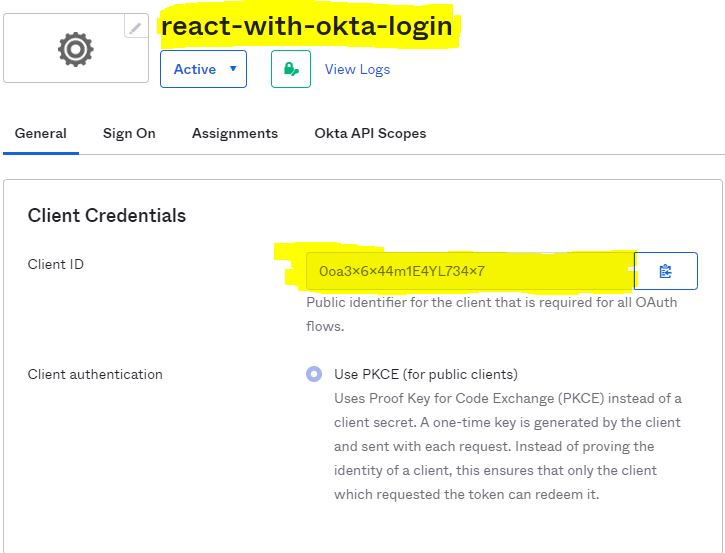
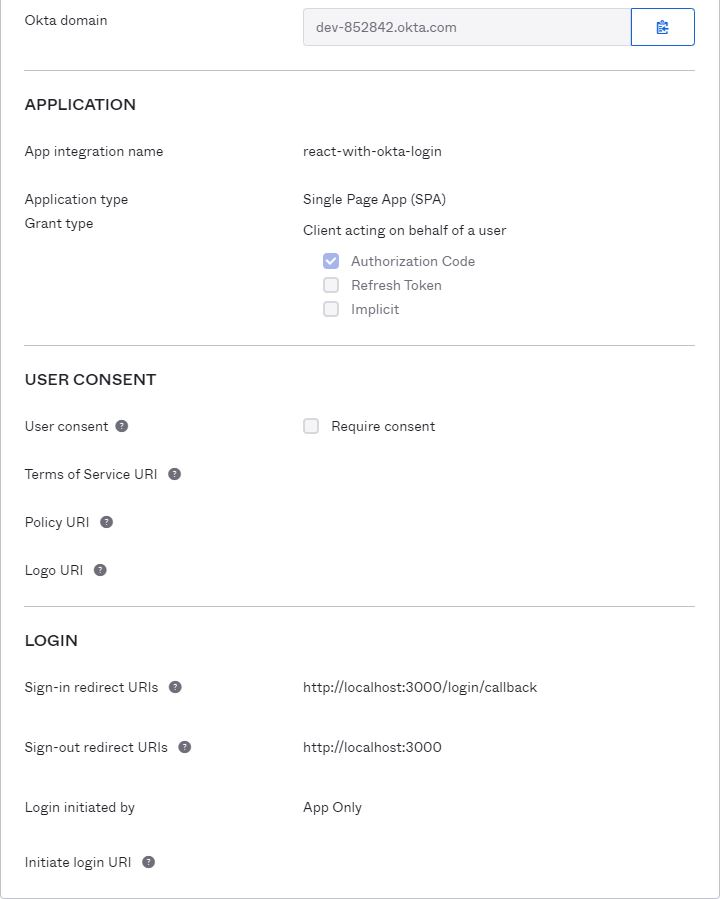

# React-with-okta-login

React-with-okta-logic

# Steps

1. Create a Single Page Application in okta
   1. Give a name to app
   2. Select Authorization Grant type
      1. Authorization Code
      2. Refresh Token
   3. Put Sign-in redirect URIs as `http://localhost:3000/login/callback`
   4. Sign-ot redirect URIs as `http://localhost:3000`
2. Get the `Client ID` and okta `domain name`
3. Place it into .env file to make it work this application for you.

# Images

## Client ID is here

## Rest app will look like this

# Issues and Solution

### 1. Might see infinite loading issue while log in.

    This only occurs when you trying to test you app login functionality in the same browser in which you are already logged in as a admin.

# Resource

1. https://developer.okta.com/code/react/okta_react_sign-in_widget
